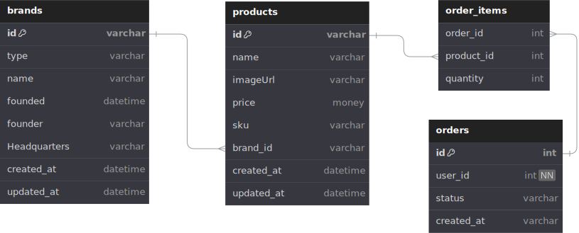

# Tech SPot

[Tech Spot] (https://techspot.josapratama.com) Tech Spot online store for various kinds of smartphones

Table of Contents:

- [Tech Spot](#tech-spot)
  - [Links](#links)
  - [Features](#features)
  - [UI Designs](#ui-designs)
    - [Home Page](#home-page)

## Links

- Website/Frontend: <https://techspot.josapratama.com>
  - Backend: <https://techspot-backend.josapratama.com>
- Repositories:
  - General: <https://github.com/josapratama/techspot>
  - Backend: <https://github.com/josapratama/techspot-backend>
  - Frontend: <https://github.com/josapratama/techspot-frontend>

Inspirations:

- <https://eraspace.com/>
- <https://www.sentraponsel.com/>
- <https://jagofon.com/en>

## Features

- Home page
  - Hero section
  - Products catalogue
- Product page
  - Image
  - SKU (stock keeping unit)
  - Name
  - Price
  - Description
  - Add to cart form: quantity input & add to cart button
  - Buy Now Button
- Shopping cart page
  - Product items to buy
    - Image, name, price, quantity, total (price x quantity)
    - Remove item
  - Link: continue shopping, go to products catalogue
  - Link: checkout
- Checkout page
  - Order summary
    - Product items to buy
    - Grand total of all product items to buy
- Place order / transaction is being processed

## UI Designs

- Figma: <https://www.figma.com/design/L3OixiKckJyxLUNtkZuAcZ/techspot>

### Home Page

## Entity Relationship Diagram (ERD)

